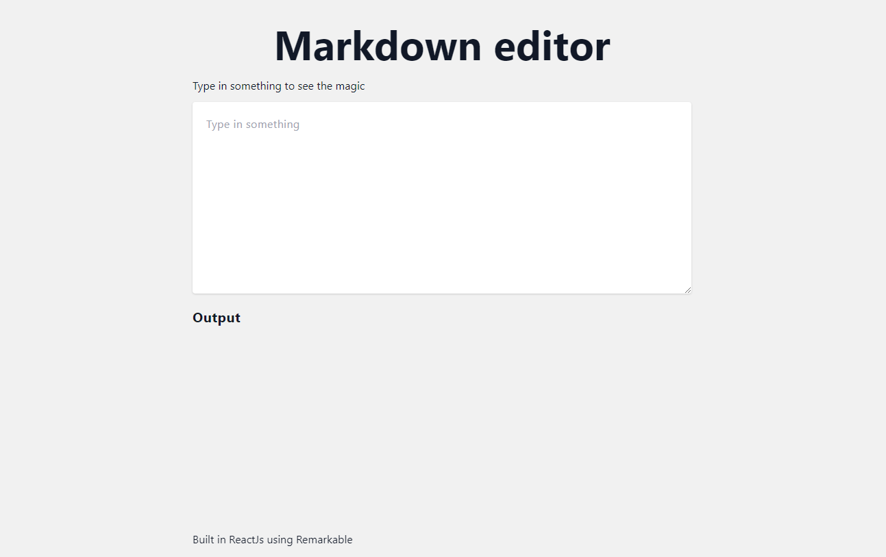

# About the markdown Editor

Built in ReactJs using the Remarkable package, this markdown editor is a conversion of the markdown example on the ReactJs website using function components instead of class components.
